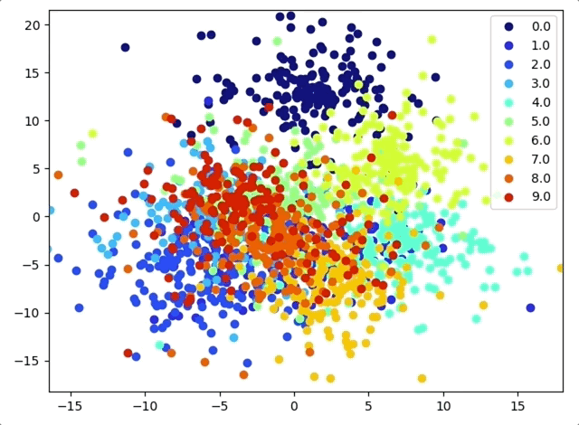

# t-SNE Interactive
This program allows the users to perform the t-Distributed Stochastic Neighbour Embedding algorithm. It allows for the creation of 
animation showcasing the progress of the application and also allows users to zoom-in to a region of graph produced in order to perform
t-SNE on the zoomed-in region (the utility of this is described in the following section).


## Introduction
t-SNE is based on the following publication by Laurens van der Maaten et al.

[Visualizing Data using t-SNE](http://www.jmlr.org/papers/volume9/vandermaaten08a/vandermaaten08a.pdf)


## Animation
This library allows you to create animations as t-SNE is going through its iterations using the `animate()` method of the `Tsne` object.
This is an example of what it looks like running on the MNIST dataset.




## Zooming-in
t-SNE is a stochastic method which means that if we are performing dimensionality reduction on a large number of points into a 2-D region,
there might be scenarios wherein points look close by virtue of being far away from other points. But it might so happen that these points
are far away n-dimensional space and t-SNE might be able to display this distance between the points by applying the algorithm on just
these points without having a lot of other noise that pushes these points together during dimensionality reduction.

The difficulty in doing this is that when we use a library like `sklearn` it is easy to n-dimenional points to 2-dimensions and plot the
2-D points on a graph. But when we want to apply t-SNE to a subsection of the graph an inverse function that maps from the points in 
2-dimensions to n-dimensions is not readily available. This program allows you to do this by simply zooming into a region of the graph 
that you want to re-perform t-SNE on and selecting the desired perplexity of the t-SNE being applied.


## Usage
Firstly, it is recommended that you install all the dependencies of this project in a virtual environment using `requirements.txt`.
```
python3 app.py --input <input-csv-file>
```
The input file here denotes the original CSV file where t-SNE is to be applied. Note that `data_generator.py` has the appropriate
methods to deal with data preprocessing.
